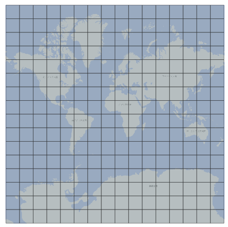

# xyztile_polygon_postgis.sql
PostGISで、EPSG:3857のxyzタイルの各タイルの範囲を示すポリゴンデータを作成するSQLプログラム

# 使い方
1. 18行目にズームレベルを指定するところがあるので、作りたいズームレベルを数値で指定してください。  
2. このSQLファイルをPostGIS上で実行してください。ポリゴンデータが入ったテーブルがPostGIS上に作成されます。
  
このようなポリゴンが作成されます。（ズームレベル4の例）  

# 注意事項
- 本レポジトリは実験的に提供しているものです。動作保証は行っておりません。
- また、予告なく変更・削除する可能性があります。
- 本レポジトリの利用により生じた損失及び損害等について、国土地理院はいかなる責任も負わないものとします。
